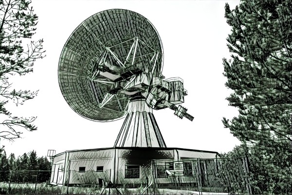

# Parcel static site generator template

This is a starter project to build a barebones static site generator with Parcel with `minimal dependencies`.

Main bundling package used:

 - Parcel v2

Markdown parsing:

 - posthtml-import
 - posthtml-markdownit

Just the essentials :)

- markdown-it-emoji
- markdown-it-highlightjs ([more styles](https://unpkg.com/browse/@highlightjs/cdn-assets@11.0.0/styles/))

### Launch development environment

```
# Install dependencies
yarn
# Then launch the preview
yarn dev
```

Build command

```
yarn dev
```

### Add live reload to HTML page

```html
<script>
   if (module.hot) {
         module.hot.accept(() => location.reload());
   }
</script>
```

### Happy building



Hey, look, even images are supported nicely. If you set an `alt` attribute, you can align images.

